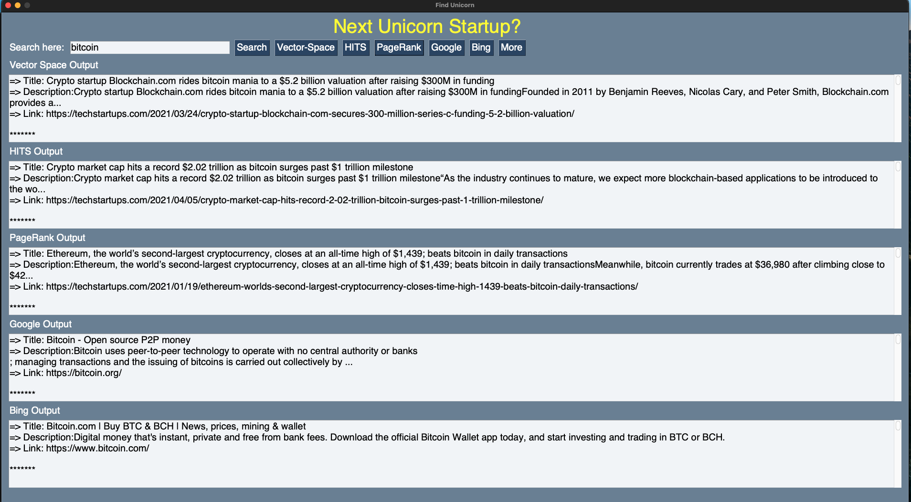

# find_unicorns
**find_unicorns** is a search-engine to look for startups/uncirons for CS6322-Information-Retrieval at UTDallas. 

---

## Modules:
- Crawling & Scraping is done to crawl 100K links and scrape 100K texts
- Searching and ranking is done by:
	- Vector-Space (TF-IDF weighting)
	- HITS (hub-score & authority-score)
	- PageRank (in- and out- links) 
- GUI is done by PySimpleGUI

---

## Demo

## Contributors:
- [quocdat3246197](https://github.com/quocdat32461997)
- [mounaimhafid](https://github.com/mounaimhafid)
- [Abhishek Thurlapati](https://github.com/aThurlapati)
